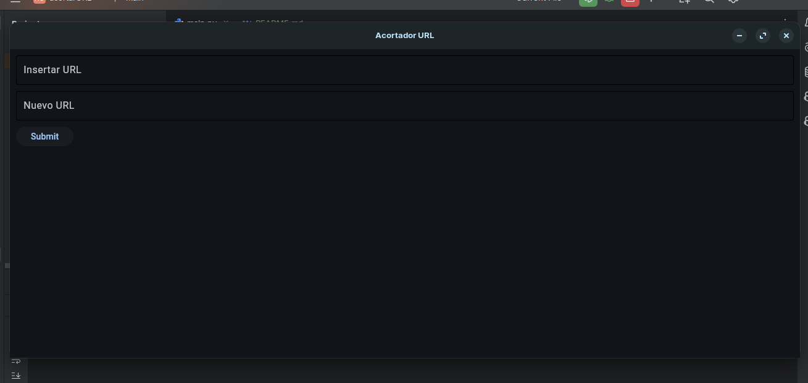

# Acortador de URL

Un servicio sencillo de acortador de URL construido con Python.

## Características

- Acortar URLs largas
- Redirigir a URLs originales usando enlaces cortos
- API simple y fácil de usar

## Requisitos

- Python 3.7+
- Pyshortener

## Instalación

1. Clona el repositorio:
    ```sh
    git clone https://github.com/yourusername/url-shortener.git
    cd acortarUrl
    ```

2. Crea un entorno virtual y actívalo:
    ```sh
    python -m venv venv
    source venv/bin/activate  # En Windows usa `venv\Scripts\activate`
    ```

3. Instala las dependencias:
    ```sh
    pip install -r requirements.txt
    ```

## Imagenes



